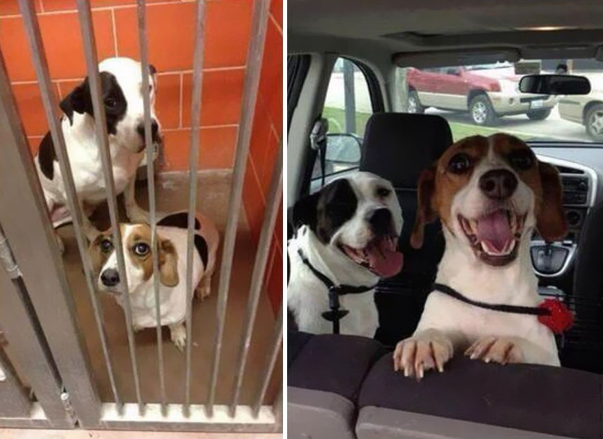

  

# Second Chances at Austin Animal Shelters 

# Project Description
This project dives into Austin's Animal Shelters statistics to find how particular features, such as breed, influence a dog's outcome. The main goal is to discover trends hidden within the data and use them as drivers in machine learning models to predict their outcome. An optimized machine learning model utilizing the uncovered drivers could be used to develop a deeper understanding of how certain outcome types are reached and create a program to increase their chances for a positive outcome.

# Initial Thoughts
My intitial thoughts on this project is that an dog's outcome will be heavily influenced by their age and breed. Their color will have a small influence on their chances at being adopted. I also wanted to explore if their time in shelter somehow made them less desireable to potential adoptive parents. 

# The Plan
1. Acquire data
2. Initial exploration with info and describe tables.
3. Clean data.
4. Create questions, visuals, and conduct statistical tests.
5. Split data.
6. Explore data on unscaled train set.
7. Model using Classification.

# Data Dictionary

| Feature | Definition |
| :-- | :-- |
| animal_id | uniqe identifier for animal |
| date_intake | date of intake |
| intake_type | method in which animal was obtained |
| intake_condition | condition/reason for animal intake | 
| animal_type | type of animal |
| age_upon_intake | age of animal when obtained |
| date_outcome | date of outcome |
| date_of_birth | birth date |
| outcome_type | outcome of animal:  - adoption  - return to owner  - euthanasia  - died |
| sex_upon_outcome | sex of animal:   - intact  - neutered  - spayed|
| age_upon_outcome |age when outcome reached |
| breed | breed of animal |
| color | color(s) of animal |
| time_in_shelter | time spent in shelter in days |
| months_in_shelter | time spent in shelter in months |
| age_months_outcome | age of animal in months when outcome reached |
| age_years_outcome | age of animal in years when outcome reached |

# Acquire

- Data acquired from data.austintexas.gov. Download link found below in 'Steps to Reroduce'.  
    - Intakes data set: 148,133 rows
    - Outcomes data set: 148,339 rows 
- Each row represents a dog
- Each column represents the dogs features and background information

# Prepare
- Renamed columns to be user friendly.
- Merged intake and outcome dataframes
    - 190,609 rows after merge
- Dropped nulls
    - 190,511 rows after drop
- Coverted date columns to datetime data types.
- Subset dataframe for only dogs
    - top 10 dog breeds (over 2000 breeds listed)
    - top 10 colors
- Subset outcome types for: 
    - adoption
    - return to owner
    - euthanasia
    - died
- After all subsets: 20,137 rows left
- Dropped columns:
    - found location
    - outcome subtype
    - duplicated columns from merge: breed, animal type, color, monthyear 
- Feature engineered new columns using existing data.
    - time in shelter
    - months in shelter
    - age in months upon outcome
    - age in years upon outcome
- Split data into three sets (56/24/20):
    - train
    - validate 
    - test 

# Explore
**Questions**
1. Does the breed influence their chances of being placed in a home?
2. Does their color influence their chances of being placed in a home?
3. Does their time in a shelter decrease their desirability to potential adoptive parents?
4. Does their age influence their chances of being adopted?

# Conclusion
All four features being tested for significance proved to influence the target variable, outcome type. There were a couple of values in particular that stood out in the visuals. Pit Bulls are being adopted or returned to their owners at a higher rate. Black and white dogs are being adopted at a drastically higher rate than dogs of different colors. Turnover rate for time in shelter to adoption is higher for adoption than other outcome types. As for age, it has a slight influence when it comes to adoption, but has a increased influence when it comes to being returned to their owner. 

# Next Steps
- Given more time, I would delve deeper into the data and explore how different features influence outcome type. Features to look into:
    - intake type (stray, owner surrender, abandoned, etc.)
    - intake condition (normal, sick, pregnant, nursing, etc.)
    - sex upon outcome (intact, neutered, spayed)
- I would also recommend exploring the adoption rates of individual breeds based on their color. 

# Steps to Reproduce

1. Clone this repo.
2. Download data:
    - Link for Intakes: https://data.austintexas.gov/Health-and-Community-Services/Austin-Animal-Center-Intakes/wter-evkm/data
    - Link for Outcomes: https://data.austintexas.gov/Health-and-Community-Services/Austin-Animal-Center-Outcomes/9t4d-g238/data
3. Use functions in acquire.py to upload data
4. Use functions in prepare.py to clean and prep data.
5. Use functions in visual.py to plot the charts.
6. Use same configurations for models.